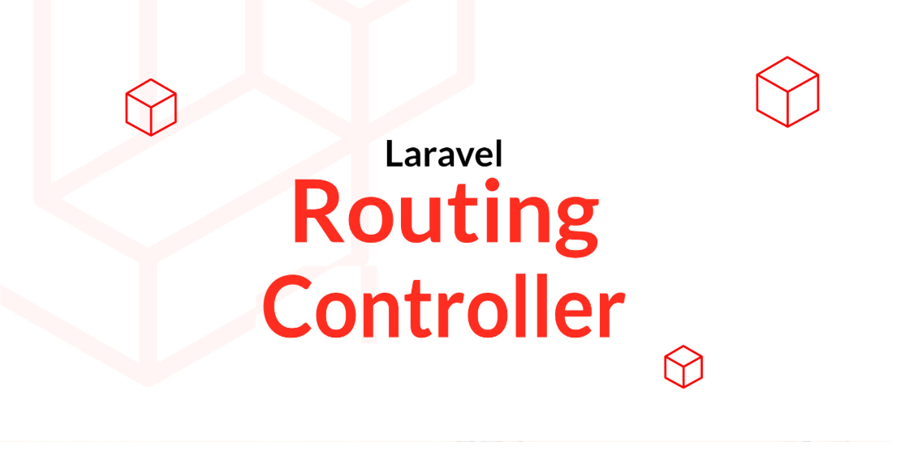

## Presentation :

> `_Advenced Concepts in Kotlin_`

##### by : _Zakaria Azizi_

##### Framed by : _Fouad Essarraj_

|||

### **1. Introduction**

|||

### **2. 2TUP Methodology:**

|||

### **3. Planning:**

<table style="font-size: 22px" >
  <tr>
    <th></th>
    <th>1</th>
    <th>2</th>
    <th>3</th>
  </tr>
  <tr>
    <td>Monday</td>
    <td>QCM</td>
    <td>Tuto-1</td>
    <td>Tuto-1</td>
  </tr>
  <tr>
    <td>Tuesday</td>
    <td>-</td>
    <td>-</td>
    <td>Tuto-2</td>
  </tr>
  <tr>
    <td>Wednesday</td>
    <td>Tuto-2</td>
    <td>Tuto-3</td>
    <td>Tuto-3</td>
  </tr>
  <tr>
    <td>Thursday</td>
    <td>Prototype</td>
    <td>File_rouge</td>
    <td>Prototype</td>
  </tr>
  <tr>
    <td>Friday</td>
    <td>Realisation</td>
    <td>Realisation</td>
    <td>File_rouge</td>
  </tr>
</table>

|||

### **4. Need:**

|||

### **5. Use Case Diagram:**

|||

### **6. Technical analysis:**

|||

### **7. Generic design::**

|||

### **8. Class Diagram:**

|||

### **9. Realisation:**

|||

### **10. Conclusion:**